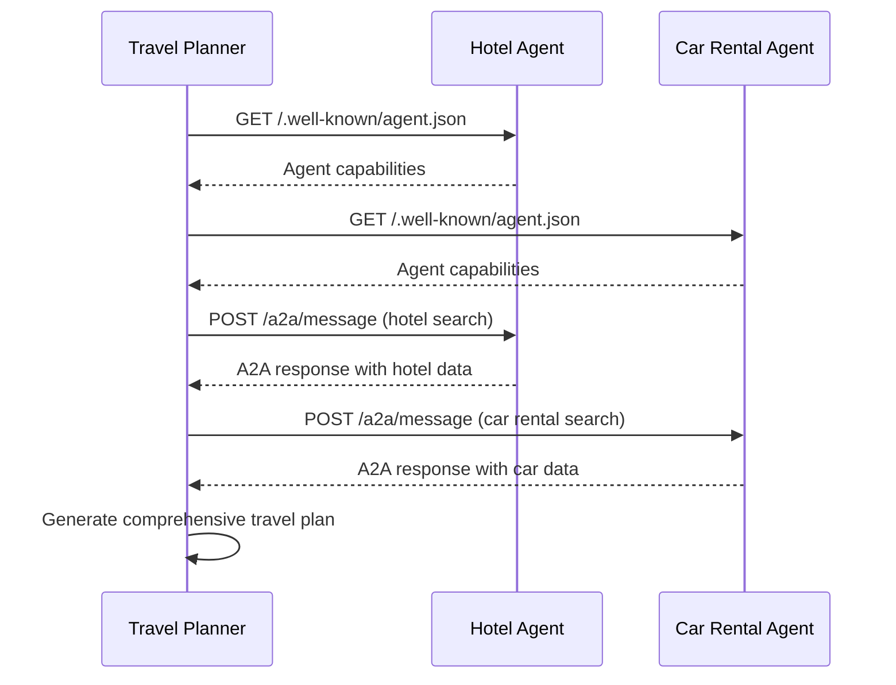

# 🤖 A2A Protocol Implementation

## Overview

This implementation provides a complete **Agent-to-Agent (A2A) protocol** system for the Travel Planner Multi-Agent system. All agents now support both A2A protocol and HTTP REST API for maximum compatibility.

## 🏗️ Architecture

### A2A Protocol Components

1. **Travel Planner Agent** (Port 10001)
   - **Primary Coordinator**: Uses A2A protocol to communicate with specialized agents
   - **Fallback Support**: Falls back to simple HTTP if A2A fails
   - **Google ADK Integration**: Sophisticated agent with A2A capabilities

2. **Hotel Booking Agent** (Port 10002)
   - **A2A Endpoints**: `/.well-known/agent.json`, `/a2a/message`
   - **HTTP REST**: `/chat`, `/health`
   - **Capabilities**: Hotel search, booking, price comparison

3. **Car Rental Agent** (Port 10003)
   - **A2A Endpoints**: `/.well-known/agent.json`, `/a2a/message`
   - **HTTP REST**: `/chat`, `/health`
   - **Capabilities**: Car rental search, booking, price comparison

## 🚀 Quick Start

### 1. Start All A2A Agents

```bash
cd travel_planning_system
python start_a2a_agents.py
```

### 2. Start Individual Agents

```bash
# Terminal 1 - Hotel Booking Agent (A2A)
cd hotel_booking_agent_crewai
python a2a_hotel_executor.py

# Terminal 2 - Car Rental Agent (A2A)
cd car_rental_agent_langgraph
python a2a_car_executor.py

# Terminal 3 - Travel Planner Agent (A2A)
cd travel_planner_agent_adk
python simple_executor.py
```

### 3. Start AG-UI Server

```bash
python start_ag_ui_server.py
```

## 🔧 A2A Protocol Endpoints

### Agent Card Discovery

Each agent exposes its capabilities via the A2A protocol:

```bash
# Hotel Agent Card
curl http://localhost:10002/.well-known/agent.json

# Car Rental Agent Card  
curl http://localhost:10003/.well-known/agent.json
```

**Example Response:**
```json
{
  "name": "Hotel Booking Agent",
  "description": "Specialized agent for hotel search and booking",
  "capabilities": [
    "hotel_search",
    "hotel_booking", 
    "price_comparison",
    "hotel_recommendations"
  ],
  "endpoints": {
    "health": "/health",
    "chat": "/chat",
    "a2a_message": "/a2a/message"
  },
  "version": "2.0.0",
  "status": "active"
}
```

### A2A Message Exchange

Send structured messages using the A2A protocol:

```bash
curl -X POST http://localhost:10002/a2a/message \
  -H "Content-Type: application/json" \
  -d '{
    "message": {
      "role": "user",
      "parts": [{"type": "text", "text": "Find hotels in New York"}],
      "messageId": "msg-123",
      "taskId": "task-456", 
      "contextId": "ctx-789"
    }
  }'
```

## 🧠 Agent Communication Flow

### A2A Protocol Flow



## 📊 Logging and Tracing

### Structured Logging

All agents implement comprehensive logging:

```python
# Example log entry
{
  "timestamp": "2025-01-10T10:30:00Z",
  "operation": "a2a_message_processing",
  "agent": "hotel_booking_agent",
  "details": {
    "message_id": "msg-123",
    "task": "Find hotels in New York",
    "duration": 2.5
  }
}
```

### Trace Context

```python
with TraceContext(logger, "a2a_communication", {
    "from_agent": "travel_planner",
    "to_agent": "hotel_agent",
    "message_type": "hotel_search"
}):
    # A2A communication happens here
    pass
```

## 🔍 Testing A2A Protocol

### 1. Test Agent Discovery

```bash
# Test hotel agent card
curl http://localhost:10002/.well-known/agent.json | jq

# Test car rental agent card
curl http://localhost:10003/.well-known/agent.json | jq
```

### 2. Test A2A Message Exchange

```bash
# Test hotel search via A2A
curl -X POST http://localhost:10002/a2a/message \
  -H "Content-Type: application/json" \
  -d '{
    "message": {
      "role": "user",
      "parts": [{"type": "text", "text": "Find budget hotels in Paris"}],
      "messageId": "test-msg-1",
      "taskId": "test-task-1",
      "contextId": "test-ctx-1"
    }
  }'
```

### 3. Test Complete Travel Planning

```bash
# Test complete travel planning via AG-UI
curl -X POST http://localhost:8000/api/plan-trip \
  -H "Content-Type: application/json" \
  -d '{
    "destination": "New York",
    "check_in": "2025-10-06",
    "check_out": "2025-10-07", 
    "guests": 2,
    "preferences": "Near Railway station"
  }'
```

## 🛠️ Configuration

### Environment Variables

```bash
# Required for all agents
GROQ_API_KEY=your_groq_api_key
SERPER_API_KEY=your_serper_api_key
```

### Agent URLs

```python
# Travel Planner Agent configuration
agent_urls = [
    "http://localhost:10002",  # Hotel Booking Agent (A2A)
    "http://localhost:10003",  # Car Rental Agent (A2A)
]
```

## 🔄 Fallback Mechanism

The system includes intelligent fallback:

1. **A2A Protocol First**: Travel Planner tries A2A communication
2. **HTTP Fallback**: If A2A fails, falls back to simple HTTP
3. **Error Handling**: Graceful degradation with detailed logging

## 📈 Performance Monitoring

### Key Metrics

- **A2A Message Latency**: Time for A2A protocol communication
- **Agent Discovery Time**: Time to fetch agent cards
- **Fallback Rate**: Percentage of requests using HTTP fallback
- **Error Rate**: Failed A2A communications

### Monitoring Endpoints

```bash
# Health checks
curl http://localhost:10001/health  # Travel Planner
curl http://localhost:10002/health  # Hotel Agent  
curl http://localhost:10003/health  # Car Rental Agent

# Agent status
curl http://localhost:10001/agents/status
```

## 🎯 Benefits of A2A Protocol

### 1. **Standardized Communication**
- Consistent message format across all agents
- Structured agent discovery
- Interoperable agent ecosystem

### 2. **Enhanced Coordination**
- Real-time agent-to-agent communication
- Context preservation across agent interactions
- Sophisticated task delegation

### 3. **Better Observability**
- Structured logging and tracing
- Performance metrics
- Error tracking and debugging

### 4. **Scalability**
- Easy addition of new agents
- Load balancing capabilities
- Distributed agent deployment

## 🚨 Troubleshooting

### Common Issues

1. **A2A Connection Failed**
   - Check if agents are running on correct ports
   - Verify agent card endpoints are accessible
   - Check network connectivity

2. **Agent Discovery Issues**
   - Ensure `/.well-known/agent.json` endpoints return valid JSON
   - Check agent capabilities are properly defined
   - Verify agent status is "active"

3. **Message Exchange Failures**
   - Validate A2A message format
   - Check agent processing capabilities
   - Review error logs for specific failures

### Debug Commands

```bash
# Check agent cards
curl -v http://localhost:10002/.well-known/agent.json
curl -v http://localhost:10003/.well-known/agent.json

# Test A2A message format
curl -X POST http://localhost:10002/a2a/message \
  -H "Content-Type: application/json" \
  -d '{"message": {"role": "user", "parts": [{"type": "text", "text": "test"}], "messageId": "test", "taskId": "test", "contextId": "test"}}'
```

## 🎉 Success Indicators

When A2A protocol is working correctly, you should see:

- ✅ Agent cards accessible at `/.well-known/agent.json`
- ✅ A2A messages processed successfully
- ✅ Travel Planner using A2A protocol (not HTTP fallback)
- ✅ Comprehensive travel plans generated
- ✅ Structured logging in agent logs

The system now provides a robust, scalable, and standardized agent-to-agent communication protocol! 🚀
