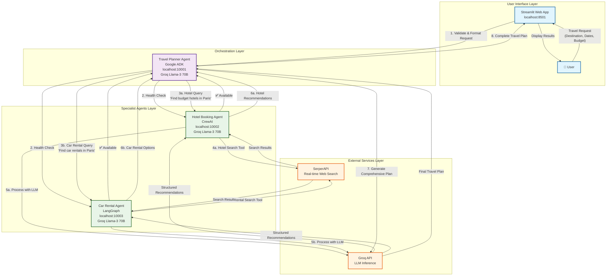
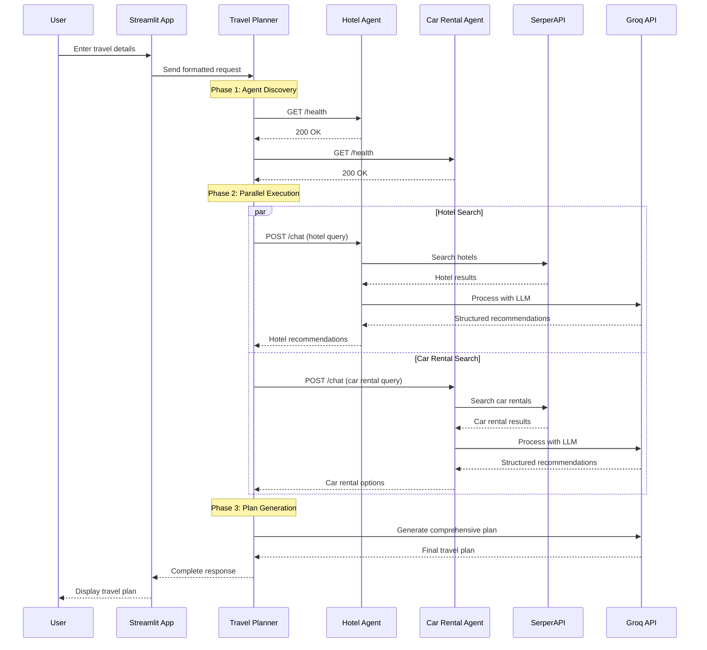
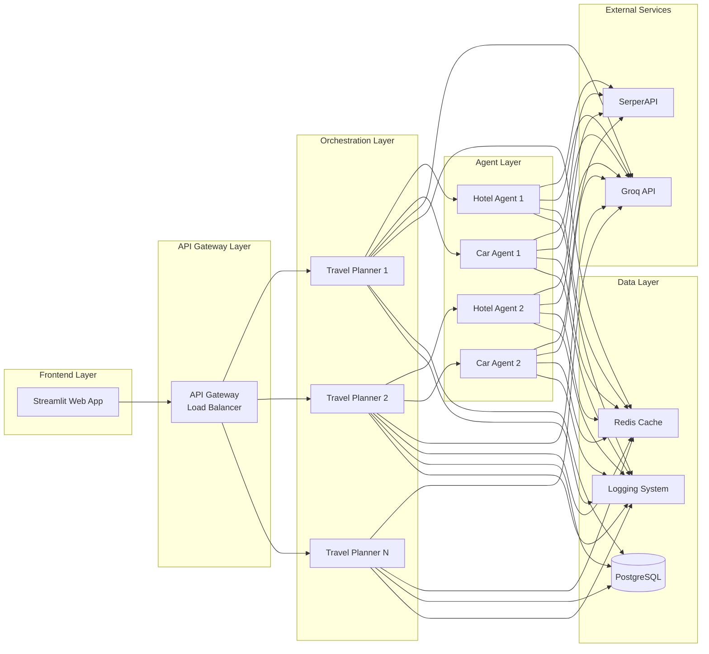
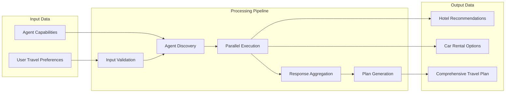
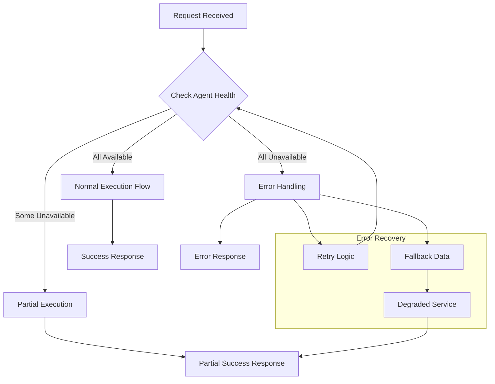
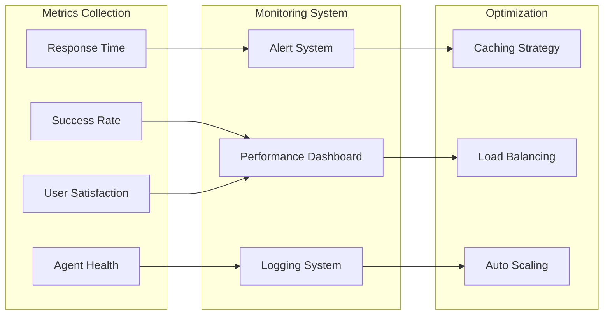

# Multi-Agent Travel Planning System - Mermaid Architecture Diagram

## 🔄 Complete System Workflow

## 🔍 Detailed Agent Communication Flow

## 🏗️ System Architecture Overview

## 🔄 Agent Internal Workflow

```mermaid
graph TD
    subgraph "Hotel Agent (CrewAI) Internal Flow"
        HA_IN[Input Query]
        HA_CREW[CrewAI Workflow]
        HA_TOOL[Hotel Search Tool]
        HA_LLM[LLM Processing]
        HA_OUT[Structured Output]
        
        HA_IN --> HA_CREW
        HA_CREW --> HA_TOOL
        HA_TOOL --> HA_LLM
        HA_LLM --> HA_OUT
    end
    
    subgraph "Car Rental Agent (LangGraph) Internal Flow"
        CA_IN[Input Query]
        CA_GRAPH[LangGraph State Machine]
        CA_TOOL[Car Rental Tool]
        CA_LLM[LLM Processing]
        CA_OUT[Structured Output]
        
        CA_IN --> CA_GRAPH
        CA_GRAPH --> CA_TOOL
        CA_TOOL --> CA_LLM
        CA_LLM --> CA_OUT
    end
    
    subgraph "Travel Planner (Google ADK) Internal Flow"
        TP_IN[User Request]
        TP_DISCOVER[Agent Discovery]
        TP_COORD[Coordinate Agents]
        TP_AGGREGATE[Aggregate Responses]
        TP_GENERATE[Generate Final Plan]
        TP_OUT[Complete Travel Plan]
        
        TP_IN --> TP_DISCOVER
        TP_DISCOVER --> TP_COORD
        TP_COORD --> TP_AGGREGATE
        TP_AGGREGATE --> TP_GENERATE
        TP_GENERATE --> TP_OUT
    end
```

## 📊 Data Flow Architecture

## 🚨 Error Handling Flow

## 📈 Performance Monitoring

These diagrams provide a comprehensive view of the multi-agent travel planning system architecture, showing the complete workflow from user input to final response, including agent communication, error handling, and system monitoring. 