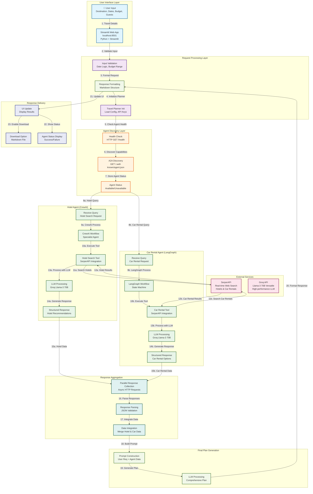
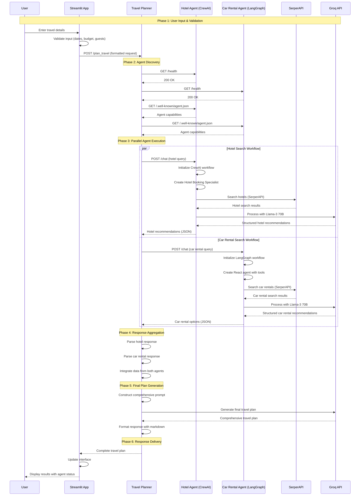
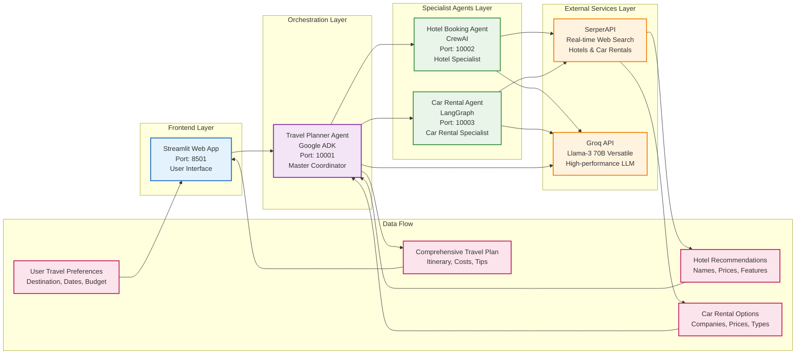
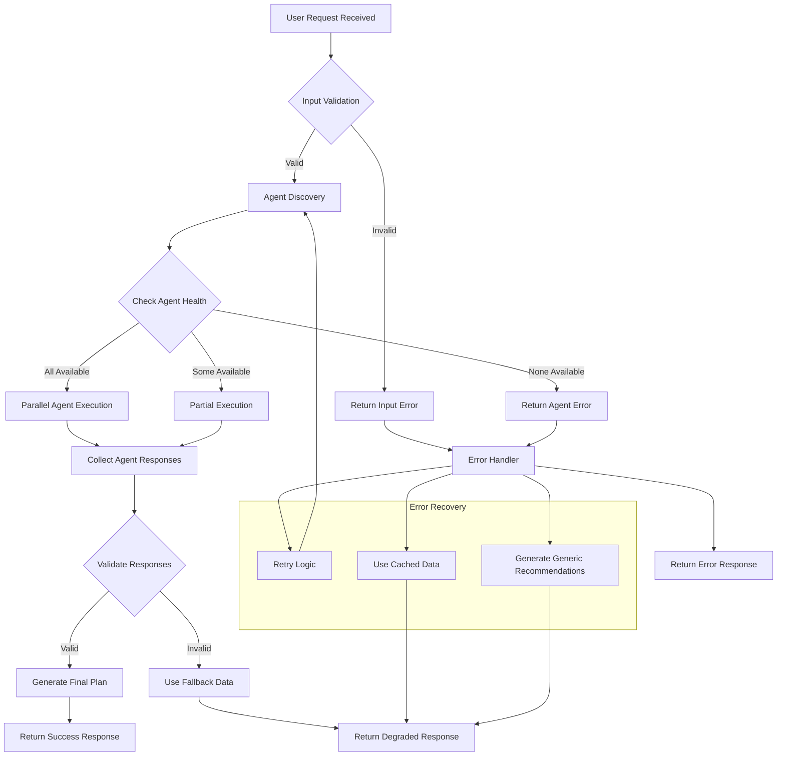
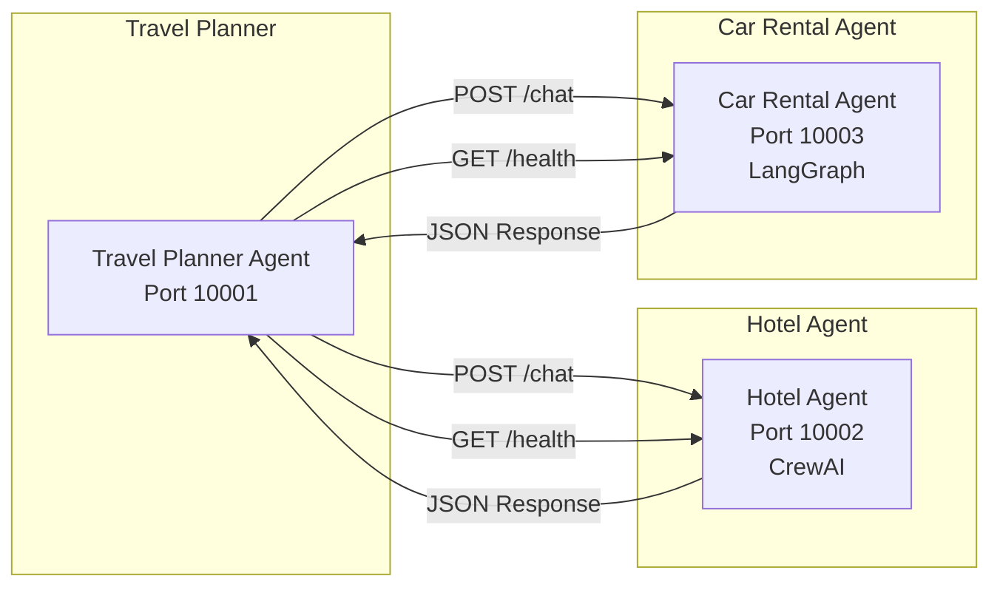
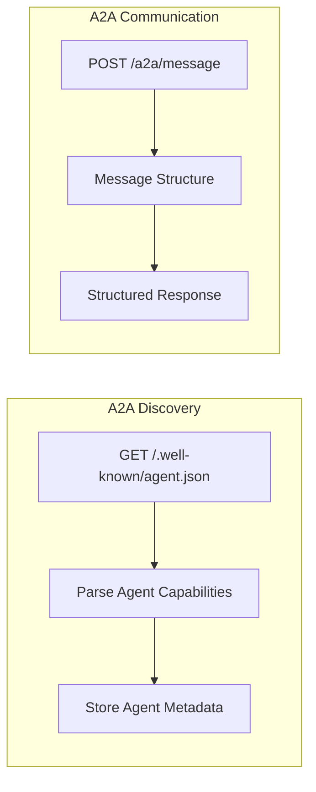
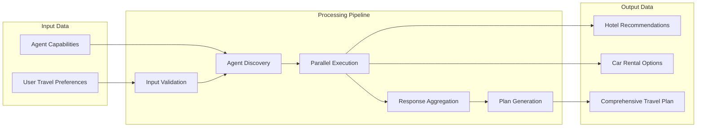

# Complete Multi-Agent Travel Planning System - Mermaid Workflow Diagram

## 🔄 Complete System Workflow with Technical Details

## 🔍 Detailed Agent Communication Sequence

## 🏗️ System Architecture with Data Flow

## 🔄 Agent Internal Workflow Details

```mermaid
graph TD
    subgraph "Hotel Agent (CrewAI) Internal Flow"
        HA_IN[Input: Hotel Search Query]
        HA_CREW[CrewAI Workflow Initialization]
        HA_SPECIALIST[Create Hotel Booking Specialist]
        HA_TASK[Define Task: Search & Recommend Hotels]
        HA_EXECUTE[Execute Sequential Process]
        HA_TOOL[Hotel Search Tool Execution]
        HA_SERPER[SerperAPI Search]
        HA_PARSE[Parse Search Results]
        HA_LLM[LLM Analysis & Ranking]
        HA_RECOMMEND[Generate Hotel Recommendations]
        HA_OUT[Output: Structured Hotel Data]
        
        HA_IN --> HA_CREW
        HA_CREW --> HA_SPECIALIST
        HA_SPECIALIST --> HA_TASK
        HA_TASK --> HA_EXECUTE
        HA_EXECUTE --> HA_TOOL
        HA_TOOL --> HA_SERPER
        HA_SERPER --> HA_PARSE
        HA_PARSE --> HA_LLM
        HA_LLM --> HA_RECOMMEND
        HA_RECOMMEND --> HA_OUT
    end

    subgraph "Car Rental Agent (LangGraph) Internal Flow"
        CA_IN[Input: Car Rental Query]
        CA_GRAPH[LangGraph State Machine]
        CA_REACT[Create React Agent with Tools]
        CA_STATE[Define State Schema]
        CA_EXECUTE[Execute Graph-based Reasoning]
        CA_TOOL[Car Rental Tool Execution]
        CA_SERPER[SerperAPI Search]
        CA_PARSE[Parse Search Results]
        CA_LLM[LLM Analysis & Comparison]
        CA_RECOMMEND[Generate Car Rental Recommendations]
        CA_OUT[Output: Structured Car Rental Data]
        
        CA_IN --> CA_GRAPH
        CA_GRAPH --> CA_REACT
        CA_REACT --> CA_STATE
        CA_STATE --> CA_EXECUTE
        CA_EXECUTE --> CA_TOOL
        CA_TOOL --> CA_SERPER
        CA_SERPER --> CA_PARSE
        CA_PARSE --> CA_LLM
        CA_LLM --> CA_RECOMMEND
        CA_RECOMMEND --> CA_OUT
    end

    subgraph "Travel Planner (Google ADK) Internal Flow"
        TP_IN[Input: User Travel Request]
        TP_INIT[Initialize Configuration]
        TP_DISCOVER[Agent Discovery & Health Check]
        TP_COORD[Coordinate Parallel Execution]
        TP_COLLECT[Collect Agent Responses]
        TP_PARSE[Parse & Validate Responses]
        TP_INTEGRATE[Integrate Hotel & Car Data]
        TP_PROMPT[Construct Comprehensive Prompt]
        TP_GENERATE[Generate Final Travel Plan]
        TP_FORMAT[Format Response]
        TP_OUT[Output: Complete Travel Plan]
        
        TP_IN --> TP_INIT
        TP_INIT --> TP_DISCOVER
        TP_DISCOVER --> TP_COORD
        TP_COORD --> TP_COLLECT
        TP_COLLECT --> TP_PARSE
        TP_PARSE --> TP_INTEGRATE
        TP_INTEGRATE --> TP_PROMPT
        TP_PROMPT --> TP_GENERATE
        TP_GENERATE --> TP_FORMAT
        TP_FORMAT --> TP_OUT
    end
```

## 📊 Performance & Error Handling Flow

## 🔧 Technical Implementation Details

### **Agent Communication Protocols**

#### **HTTP REST API (Current Implementation)**

#### **A2A Protocol (Advanced Implementation)**

### **Data Transformation Pipeline**

This comprehensive Mermaid diagram provides a complete visual representation of the multi-agent travel planning system workflow, including all technical details, data flows, error handling, and performance characteristics. 